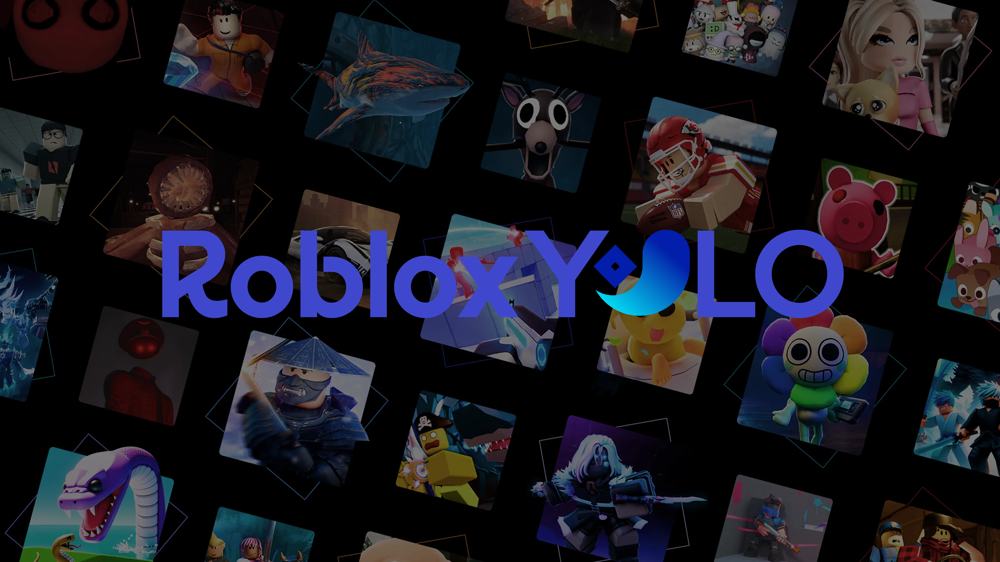
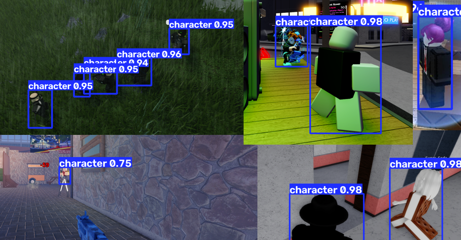
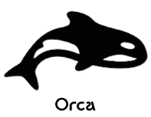
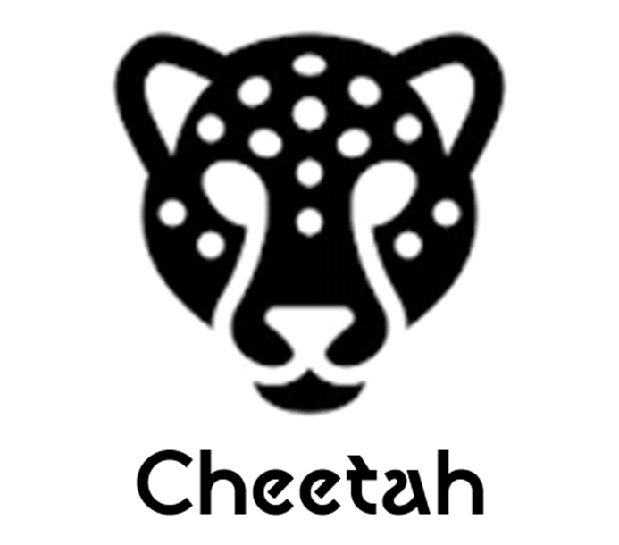
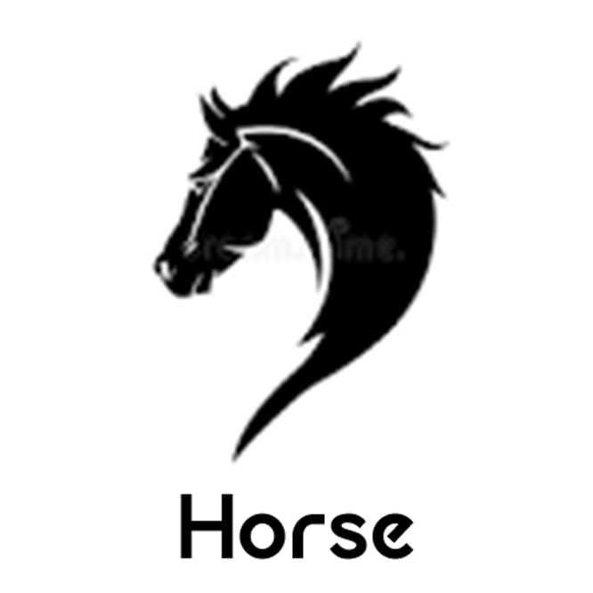

## Roblox YOLO26 Overview

Roblox-YOLO26 are a set of high-accuracy Roblox character detection models developed by Rolpon. They take advantage of YOLO26 hybrid architecture and years of computer vision research to produce general purpose Roblox detection models suitable for moderation, bot, automation, and accessibility purposes. These models have been rigorously trained on a variety of Roblox games to ensure complete platform capable detection. 

## Usage & Showcase

Check out examples/real_time_inference.py for using the models in real time!
Make sure to export to ONNX or TensorRT if you plan to use these models in real time.
The models only have 1 class, "character". Detects both alive and dead roblox characters.

```python
from ultralytics import YOLO

# Load a rblx YOLO model
model = YOLO("models/rblx-yolo-cheetah.pt")

# Perform object detection on an image
results = model("sample_images/image1.png")  # Predict on an image
results[0].show()  # Display results
```

**Export a Model**

```python
from ultralytics import YOLO

# Load a rblx YOLO model
model = YOLO("models/rblx-yolo-cheetah.pt")

# Export the model to ONNX format for deployment
path = model.export(format="onnx")  # Returns the path to the exported model

# Export the model to TensorRT format for deployment on CUDA
path = model.export(format="engine", dynamic=False, quantize=16)
```



## Available Models

*Note: mAP numbers were determined via the 200 image test set.*

<p align="center">

</p>

**Orca** - YOLO26s model at imgsz 1536.
Most powerful and accurate model, getting 79% mAP50 and 58.7% mAP50-95.
Trained on human-only data with augmentation settings turned up.

<p align="center">
 
</p>

**Cheetah** - YOLO26n model at imgsz 1280.
Trained on hand-labeled images with an mAP50 of 74.7% and mAP50-95 of 53%.
Good for real-time inference.

<p align="center">

</p>

**Horse** - YOLO26s model at imgsz 1024.
Trained on hand-labeled images mixed with difficult and rigorous synthetic data.
68.5% mAP50 and 50.7% mAP50-95.
Good for reliability.

## Training

The dataset is public on Roboflow. You will need a beefy computer or Google Colab to train a model.
Dataset Link: https://universe.roboflow.com/rolpon/roblox-yolo26-detector
Test Set Link: https://universe.roboflow.com/rolpon/publictestset

```python
from ultralytics import YOLO

# Load a YOLO model from COCO
model = YOLO("yolo26s.pt")

# Train a YOLO model
model.train(data="data.yaml", epochs=300, patience=50, name="roblox-yolo-custom")
```

## Documentation

**Labeling Spec**
- Try to include all visible pixels of a character (1 box per char) (exceptions, see below)
- If multiple characters intersect, attempt to give each character a unique box
- Tightest possible bounding boxes, no name tags included
- If a avatar is holding a large item or cosmetic item (ex: big wings on back, a huge sword, etc.) the bounding box should only include the visible extends of the avatar's body. If the item is small, it may be included in the bounding box.
- large items: items that take up a similar amount of space to the actual character or increase width\height by 40% or more (easily eyeball-able)
- ALL non-roblox images are background (real life photos, browsers, desktop environment, roblox website, etc)
- If a roblox screenshot contains a painting or object with roblox characters inside it, but the characters are not actual characters, the characters should be ignored as background. Otherwise, all characters should be included.

**Dataset Creation**
- Copy in hand labeled data
- Train/Val Split 80%/20%
- Generate icon syn data
- Generate BG syn data
- Generate regular syn data

**Model and Training Trends**
- More syn data = better model
- yolo26s.pt works best (for now)
- 250 - 400 epochs works best
- imgsz 1024-1500 seems to be good
- batch 12, workers 7 ideal setup for YOLO26s

## Pain Points

List of struggle points with the model and suggested solutions.

*UI/Overlays on top of characters*

Solution: Synthetically placing UI icons on hand-labeled images OR manually collecting character/UI overlays

*Overlapping characters*

Solution: Synthetically generate data and grab bounding boxes via Studio

*UI elements being confused for characters*

Solution: Synthetically placing UI icons on hand-labeled images

*FPS Viewmodels / Arm Animations*

Solution: Synthetically overlay view models on hand-labeled images or manually collect data from games like Arsenal

*Human Faces*

Solution: Grab real-life pictures of humans and train them as background.

*Close up shots of characters*

Solution: Manual collection using third person camera or going close to people in first person.

*Far shots of characters*

Solution: Manually collect faraway characters or synthetically generate data via Studio.

*Effects/particles on characters*

Solution: Manually collect effect-heavy characters or synthetically generate data via Studio.

*MM2 Paintings*

Solution: Go into MM2, Doors, Online pictures and manually collect painting pictures

*Extremely large or odd avatars (wings, arms, etc)*

Solution: Join a hangout game and manually collect pictures

## Disclaimers & Disclosures

Claude AI was used to assist in the planning, use, and production of these AI models. Rolpon does not condone cheating, hacking, or exploiting on Roblox. These models were developed for educational and hobbyist purposes.
Rolpon is not responsible for any potential malicious use of these tools.
