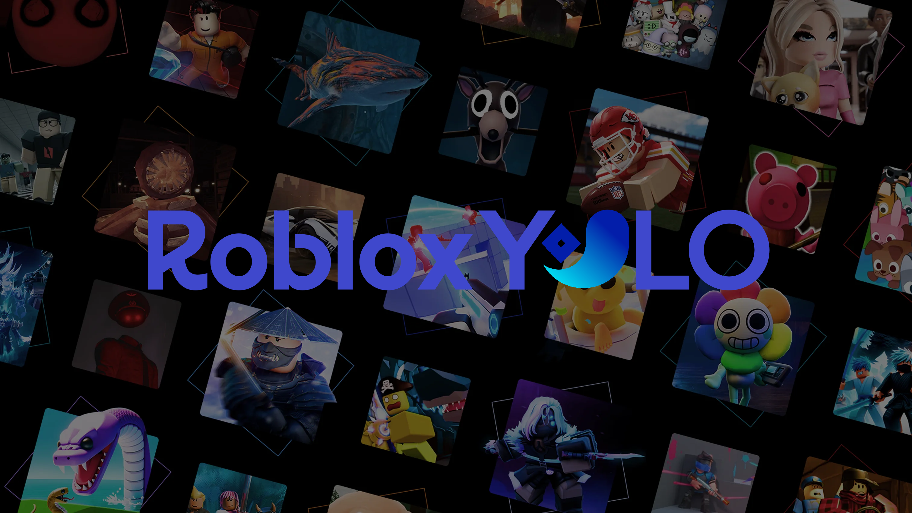
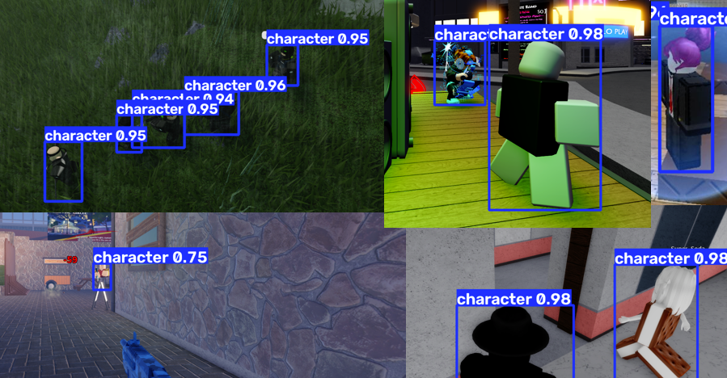
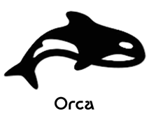
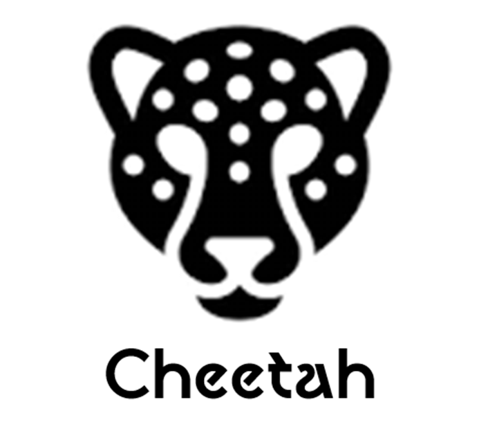
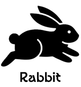
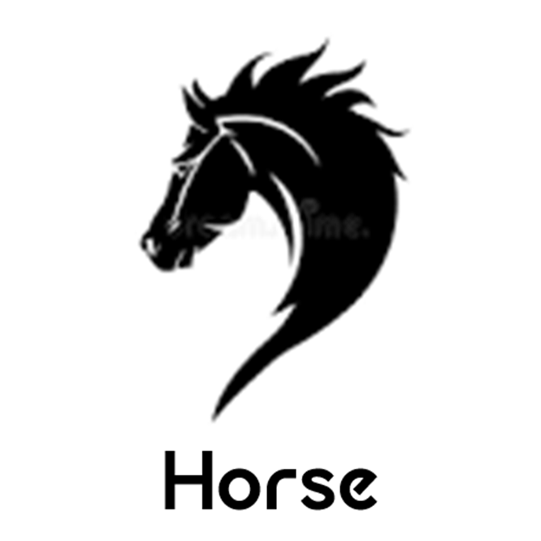

## Roblox YOLO Overview

Roblox-YOLO are a set of high-accuracy Roblox character detection models developed by Rolpon. They take advantage of YOLO26 to produce general purpose Roblox detection models suitable for autonomous bots. These models have been rigorously trained on a variety of Roblox games to ensure complete platform capable detection. 

## Usage & Showcase

Check out examples/real_time_inference.py for using the models in real time!
Make sure to export to ONNX or TensorRT if you plan to use these models in real time.
The models only have 1 class, "character". Detects both alive and dead roblox characters.

```python
from ultralytics import YOLO

# Load a rblx YOLO model
model = YOLO("models/rblx-yolo-cheetah.pt")

# Perform object detection on an image
results = model("sample_images/image1.png")  # Predict on an image
results[0].show()  # Display results
```

**Export a Model**

```python
from ultralytics import YOLO

# Load a rblx YOLO model
model = YOLO("models/rblx-yolo-cheetah.pt")

# Export the model to ONNX format for deployment
path = model.export(format="onnx")  # Returns the path to the exported model

# Export the model to TensorRT format for deployment on CUDA
path = model.export(format="engine", dynamic=False, quantize=16)
```



## Available Models

*Note: mAP numbers were determined via the 200 image test set.*

<p align="center">

</p>

**Orca** - YOLO26s model at imgsz 1536.
Most powerful and accurate model, getting 79% mAP50 and 58.7% mAP50-95.
Trained on human-only data with augmentation settings turned up.

<p align="center">
 
</p>

**Cheetah** - YOLO26n model at imgsz 1280.
Trained on hand-labeled images with an mAP50 of 74.7% and mAP50-95 of 53%.
Good for real-time inference.

<p align="center">

</p>

**Rabbit** - YOLO26n model at imgsz 640.
Fastest model yet, recommended for real-time inference on lower-end GPUs.
64.4% mAP50 and 41.1% mAP50-95.
Trained on human-only data with augmentation settings turned up.

<p align="center">

</p>

**Horse** - YOLO26s model at imgsz 1024.
Trained on hand-labeled images mixed with difficult and rigorous synthetic data.
68.5% mAP50 and 50.7% mAP50-95.
Good for reliability.

## Training

The dataset is public on Roboflow. You will need a beefy computer or Google Colab to train a model.
Dataset Link: https://universe.roboflow.com/rolpon/roblox-yolo26-detector
Test Set Link: https://universe.roboflow.com/rolpon/publictestset

```python
from ultralytics import YOLO

# Load a YOLO model from COCO
model = YOLO("yolo26s.pt")

# Train a YOLO model
model.train(data="data.yaml", epochs=300, patience=50, name="roblox-yolo-custom")
```

## Documentation

LABELING SPEC:
→ Try to include all visible pixels of a character (1 box per char) (exceptions, see below)
→ If multiple characters intersect, attempt to give each character a unique box
→ Tightest possible bounding boxes, no name tags included
→ If individual bounding boxes are truly not possible, do single-blob box.
→ Bounding boxes include ALL extents of a character, including wings, large arms, accessories, etc. Particles, however, will not be counted.
→ Highlights of characters will be counted.
→ ALL non-roblox images are background (real life photos, browsers, desktop environment, roblox website, etc)
→ Fake roblox characters, UI character renders, and paintings do not count as characters. Only NPCs and Player characters counts.
→ Dead characters are accounted for, either in their own class or merged with the character class.
DATASET CREATION:
→ Copy in hand labeled data
→ Add in percents of merc, randomizer, and external
→ Train/Val Split 80%/20%
→ Generate icon syn data
→ Generate BG syn data
→ Generate regular syn data
MODEL/TRAINING TRENDS
→ More syn data = better model
→ External models have a 50/50 chance of being better than COCO
→ yolo26s.pt works best (for now)
→ 250 - 400 epochs works best
→ imgsz 1024 seems to be good
→ batch 16, workers 8 ideal setup
PAIN POINTS
→ P: UI/Overlays ontop of characters
→ S: Syn data OR manually collect
→ P: Overlapping characters
→ S: Studio syn/Manual collect
→ P: Small Trees/Blocky Objects false positives
→ S: Manual collect
→ P: UI elements being confused for characters
→ S: Syn data
→ P: Close up shots of characters
→ S: Manual collect
→ P: Far shots of characters
→ S: Studio syn and isle manual collect
→ P: Effects/particles on characters
→ S: Syn data/Studio syn
→ P: MM2 Paintings
→ S: Go into MM2, Doors, Online pictures and manual collect


## Disclaimers & Disclosures

Claude AI was used to assist in the planning, use, and production of these AI models. These models can be used for aimbot purposes, and I will not ban those uses. I will, however, severely discourage them. I will not accept aimbot related changes. These models were developed for hobbyist and utility purposes, not to cheat. Aimbotting on Roblox via YOLO and macro programs violates Roblox ToS and could result in a ban.

See me labeling data: https://youtu.be/3P5Tr6R4R_I
